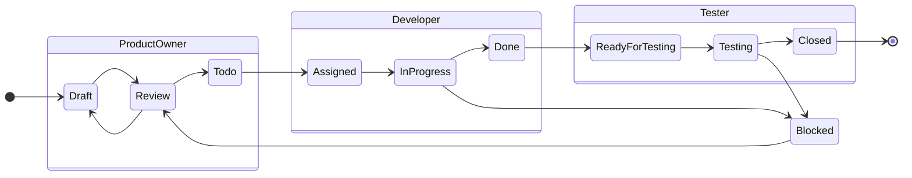

# Markdown-Special
 Less known MD options on GitHub

## Math

[More info here](https://github.blog/2022-05-19-math-support-in-markdown/)

[Live editor](https://www.mathjax.org/#demo)

Use `$$ FORMULA $$`

$$ \displaylines{
    a^{p^k-1}+a^{q^k-1}  \equiv ( a^{p^kq^k-1} -1 ) \mod pq \\
    a^{p^k+q^k} \equiv a^{p^kq^k+1} \mod pq \\
    \forall a,k \in \mathbb{N} \\
    \forall p,q \in \mathbb{N_p} 
}$$


## Diagrams

[More info here](https://github.blog/2022-02-14-include-diagrams-markdown-files-mermaid/)

[Live editor](https://mermaid-js.github.io/mermaid-live-editor/)

Use `` ```mermaid `` when writing a code block.




